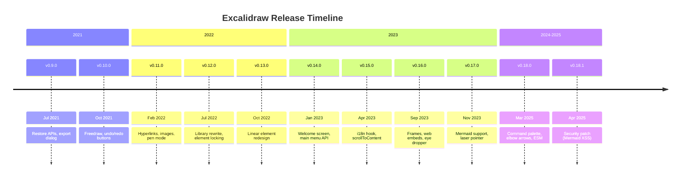
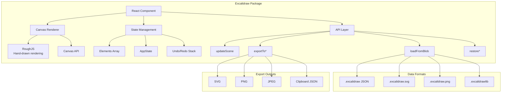
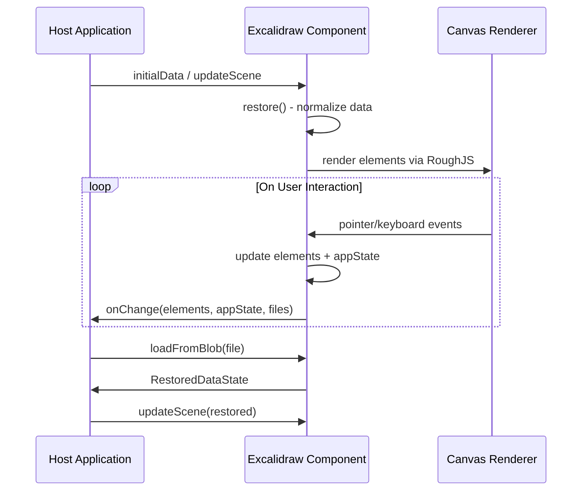

# Excalidraw: Deep Research

Excalidraw is a free, open-source virtual whiteboard tool for creating hand-drawn-like diagrams, wireframes, and sketches. Launched in January 2020 and hosted at [excalidraw.com](https://excalidraw.com), it is written in TypeScript/React and distributed as both a web application and an embeddable npm package (`@excalidraw/excalidraw`). The project is licensed under MIT and has over 125,000 GitHub stars, making it one of the most popular open-source drawing tools.

---

## Core Functionality

### Drawing Elements

Excalidraw supports the following element types on the canvas:

| Category   | Element Types                                                          |
|------------|------------------------------------------------------------------------|
| Shapes     | Rectangle, Diamond, Ellipse                                            |
| Lines      | Line, Arrow (with arrowhead options: triangle, circle, dot)            |
| Text       | Standalone text, text bound to containers (sticky notes), arrow labels |
| Freeform   | Freedraw (hand-drawn paths)                                            |
| Media      | Image (embedded or linked)                                             |
| Structural | Frame (grouping container for export/layout)                           |
| Embeds     | Web embeds (iframes for whitelisted domains)                           |

### Editor Features

- **Infinite canvas** with pan and zoom (up to 3,000%)
- **Dark mode** with dedicated theme
- **Grid mode** with snap-to-grid and alignment snapping
- **Zen mode** (distraction-free full-canvas editing)
- **View mode** (read-only)
- **Element locking** to prevent accidental edits
- **Undo/redo** with full history stack (multiplayer-aware since v0.18)
- **Grouping and ungrouping** of elements
- **Z-index ordering** (bring forward, send backward)
- **Flipping** (horizontal and vertical) for single and multiple elements
- **Multi-point line editing** with midpoint insertion
- **Elbow arrows** (since v0.18) for flowchart-style routing
- **Image cropping** (since v0.18)
- **Laser pointer** for presentations
- **Command palette** (since v0.18)
- **Scene search** (since v0.18)
- **Element linking** (hyperlinks on elements, since v0.18)
- **Text wrapping in containers** (since v0.18)
- **Mermaid diagram import** (flowcharts and sequence diagrams)

### Collaboration

Excalidraw does not ship built-in collaboration in the npm package. Host applications must implement real-time sync themselves using the provided APIs (`onChange`, `onPointerUpdate`, `updateScene`, etc.). The public web app at excalidraw.com uses Firebase for live collaboration with end-to-end encryption.

### Localization

Excalidraw supports internationalization with 30+ languages. The `langCode` prop and `useI18n()` hook allow host apps to control the language and translate custom UI strings.

---

## Export Formats

Excalidraw supports exporting scene data in the following formats:

### Native Formats

| Format             | Extension        | MIME Type          | Description                                        |
|--------------------|------------------|--------------------|----------------------------------------------------|
| Excalidraw JSON    | `.excalidraw`    | `application/json` | Full scene data with elements, appState, and files |
| Excalidraw Library | `.excalidrawlib` | `application/json` | Library items for the shape library panel          |

### Image/Vector Formats

| Format        | Export API                                            | Description                                              |
|---------------|-------------------------------------------------------|----------------------------------------------------------|
| **SVG**       | `exportToSvg()`                                       | Scalable vector output with optional embedded scene data |
| **PNG**       | `exportToBlob()` / `exportToCanvas()`                 | Raster output, default format                            |
| **JPEG**      | `exportToBlob({ mimeType: 'image/jpeg' })`            | Lossy raster output (background forced to opaque)        |
| **WebP**      | `exportToBlob({ mimeType: 'image/webp' })`            | Modern raster format                                     |
| **Clipboard** | `exportToClipboard({ type: 'png' / 'svg' / 'json' })` | Copy to system clipboard                                 |

### Export Options

All export APIs accept configuration via `appState` attributes:

- `exportBackground` -- include canvas background (default: `true`)
- `viewBackgroundColor` -- background color (default: `#fff`)
- `exportWithDarkMode` -- render in dark theme (default: `false`)
- `exportEmbedScene` -- embed recoverable scene data in SVG/PNG (default: `false`)
- `exportPadding` -- padding around exported content (default: `10`)
- `maxWidthOrHeight` -- constrain maximum dimension
- `getDimensions` -- custom width/height/scale callback

### Font Subsetting (v0.18+)

Since v0.18, SVG exports use font subsetting, embedding only the glyphs actually used in the diagram. This dramatically reduces SVG file sizes.

---

## File Structure

### The `.excalidraw` Format

The `.excalidraw` file is a plain-text JSON document. It does **not** follow a formal, published JSON Schema specification (like a `$schema`-referenced document). However, the codebase defines TypeScript types that serve as the authoritative schema.

### Top-Level Attributes

```json
{
  "type": "excalidraw",
  "version": 2,
  "source": "https://excalidraw.com",
  "elements": [],
  "appState": {},
  "files": {}
}
```

| Attribute  | Type     | Description                                           |
|------------|----------|-------------------------------------------------------|
| `type`     | `string` | Always `"excalidraw"` for scene files                 |
| `version`  | `number` | Schema version (currently `2`)                        |
| `source`   | `string` | URL of the application that created the file          |
| `elements` | `array`  | Ordered array of element objects on the canvas        |
| `appState` | `object` | Editor state: grid size, background color, zoom, etc. |
| `files`    | `object` | Binary file data (images) keyed by file ID            |

### Element Properties

Every element shares a common base of properties, with type-specific additions:

```json
{
  "id": "pologsyG-tAraPgiN9xP9b",
  "elementable": true,
  "type": "rectangle",
  "x": 928,
  "y": 319,
  "width": 134,
  "height": 90,
  "angle": 0,
  "strokeColor": "#1e1e1e",
  "backgroundColor": "transparent",
  "fillStyle": "solid",
  "strokeWidth": 2,
  "strokeStyle": "solid",
  "roughness": 1,
  "opacity": 100,
  "roundness": { "type": 3 },
  "groupIds": [],
  "frameId": null,
  "index": "a0",
  "seed": 2103493283,
  "version": 1,
  "versionNonce": 1150084322,
  "isDeleted": false,
  "boundElements": null,
  "updated": 1690295874454,
  "link": null,
  "locked": false,
  "customData": null
}
```

| Property          | Type          | Description                                                                                                          |
|-------------------|---------------|----------------------------------------------------------------------------------------------------------------------|
| `id`              | `string`      | Unique element identifier                                                                                            |
| `type`            | `string`      | Element type: `rectangle`, `diamond`, `ellipse`, `arrow`, `line`, `text`, `freedraw`, `image`, `frame`, `embeddable` |
| `x`, `y`          | `number`      | Position in scene coordinates                                                                                        |
| `width`, `height` | `number`      | Dimensions                                                                                                           |
| `angle`           | `number`      | Rotation in radians                                                                                                  |
| `strokeColor`     | `string`      | Stroke hex color                                                                                                     |
| `backgroundColor` | `string`      | Fill hex color or `"transparent"`                                                                                    |
| `fillStyle`       | `string`      | `"solid"`, `"hachure"`, `"cross-hatch"`                                                                              |
| `strokeWidth`     | `number`      | Stroke width: `1`, `2`, `4`                                                                                          |
| `strokeStyle`     | `string`      | `"solid"`, `"dashed"`, `"dotted"`                                                                                    |
| `roughness`       | `number`      | Hand-drawn effect: `0` (architect), `1` (default), `2` (artist)                                                      |
| `opacity`         | `number`      | `0`-`100`                                                                                                            |
| `roundness`       | `object/null` | Corner rounding config                                                                                               |
| `seed`            | `number`      | Random seed for consistent roughjs rendering                                                                         |
| `version`         | `number`      | Element version (incremented on each change)                                                                         |
| `versionNonce`    | `number`      | Random nonce for conflict detection                                                                                  |
| `isDeleted`       | `boolean`     | Soft-delete flag                                                                                                     |
| `boundElements`   | `array/null`  | References to elements bound to this one (arrows, text)                                                              |
| `groupIds`        | `array`       | Group membership IDs                                                                                                 |
| `frameId`         | `string/null` | Parent frame ID                                                                                                      |
| `index`           | `string`      | Fractional index for z-ordering                                                                                      |
| `updated`         | `number`      | Unix timestamp of last update                                                                                        |
| `link`            | `string/null` | Hyperlink URL                                                                                                        |
| `locked`          | `boolean`     | Whether element is locked                                                                                            |
| `customData`      | `object/null` | Host application custom data                                                                                         |

### Text-Specific Properties

Text elements (and text bound to containers) include:

```json
{
  "type": "text",
  "text": "Hello World",
  "fontSize": 20,
  "fontFamily": 1,
  "textAlign": "center",
  "verticalAlign": "middle",
  "containerId": null,
  "originalText": "Hello World",
  "autoResize": true,
  "lineHeight": 1.25
}
```

Font families: `1` (Virgil/hand-drawn), `2` (Helvetica/sans-serif), `3` (Cascadia/monospace), `4` (Excalidraw CJK since v0.18), plus additional fonts added in v0.18.

### Arrow-Specific Properties

```json
{
  "type": "arrow",
  "points": [[0, 0], [100, 0]],
  "startBinding": null,
  "endBinding": null,
  "startArrowhead": null,
  "endArrowhead": "triangle",
  "elbowed": false
}
```

### Image Elements

Image elements reference entries in the top-level `files` object:

```json
{
  "type": "image",
  "fileId": "3cebd7720911620a3938ce77243696149da03861",
  "status": "saved",
  "scale": [1, 1]
}
```

The corresponding `files` entry:

```json
{
  "3cebd7720911620a3938ce77243696149da03861": {
    "mimeType": "image/png",
    "id": "3cebd7720911620a3938ce77243696149da03861",
    "dataURL": "data:image/png;base64,iVBORw0KGgo...",
    "created": 1690295874454,
    "lastRetrieved": 1690295874454
  }
}
```

### Blank `.excalidraw` File

A minimal, empty Excalidraw scene:

```json
{
  "type": "excalidraw",
  "version": 2,
  "source": "https://excalidraw.com",
  "elements": [],
  "appState": {
    "gridSize": null,
    "viewBackgroundColor": "#ffffff"
  },
  "files": {}
}
```

### Clipboard Format

When copying elements to the system clipboard, the format differs slightly:

```json
{
  "type": "excalidraw/clipboard",
  "elements": [],
  "files": {}
}
```

Note: the clipboard format omits `version`, `source`, and `appState`.

### Schema Status

There is **no published JSON Schema** file (no `$schema` URI, no JSON Schema draft document). The schema is implicitly defined by the TypeScript types in the codebase (`packages/excalidraw/element/types.ts` and `packages/excalidraw/types.ts`). The `restore()` and `restoreElements()` utility functions normalize imported data, filling in missing properties with defaults, which means files with omitted fields will still load correctly.

---

## Version History



### v0.18.1 (2025-04-21)

Security patch addressing a Mermaid XSS vulnerability (CVE-2025-54881). Updates `@excalidraw/mermaid-to-excalidraw` to 2.2.2.

### v0.18.0 (2025-03-11)

The largest release in the project's history. Key highlights:

- **Command palette** for quick action access
- **Multiplayer undo/redo** -- the most requested feature
- **Editable element stats** in the stats panel
- **Text element wrapping** inside containers
- **Font picker** with additional fonts including CJK support
- **Font subsetting** for SVG export
- **Elbow arrows** for flowchart-style routing
- **Flowcharts** -- built-in flowchart support
- **Scene search** -- find elements by text content
- **Image cropping**
- **Element linking** -- link elements to external URLs

Breaking changes: UMD bundle deprecated in favor of ESM; `excalidraw-assets` folders removed; `commitToHistory` replaced by `captureUpdate` in `updateScene` API; TypeScript `moduleResolution: "node"`/`"node10"` no longer supported.

### v0.17.3 (2024-02-09)

Patch release: fixes `customData` preservation during element conversion, UMD browser build (broken since v0.17.0), and prematurely cached bounds for arrow labels.

### v0.17.0 (2023-11-14)

Major features: image tool disable option, `excalidrawAPI` prop (replacing React refs), programmatic frames API, element bounding-box helpers, Preact support. Library additions: Mermaid diagram import (flowcharts and sequence diagrams), new dark mode theme, laser pointer, element alignment snapping, copy/paste from Google Docs.

Breaking changes: React `Ref` support removed; `ready`/`readyPromise` APIs discontinued; `useDevice` hook return value changed.

### v0.16.0 (2023-09-19)

Introduced programmatic element creation (`convertToExcalidrawElements`), frames for grouping/export, web embeds (iframes), color picker redesign, eye dropper tool, image flipping, and canvas partition rendering for performance. Sidebar now supports tabs.

Breaking changes: `renderSidebar` prop removed; sidebar docking semantics changed.

### v0.15.0 (2023-04-18)

Added `scrollToContent` fit-to-viewport and animation options, `useI18n()` hook for custom component localization, and `restoreElements` opts parameter. Library features: text-in-container improvements, line height attribute, Thai language support.

### v0.14.0 (2023-01-13)

Introduced customizable welcome screen and main menu component APIs, `Footer` child component, `LiveCollaborationTrigger` component. Breaking changes: `onCollabButtonClick` removed; `renderFooter` removed; `strokeSharpness` renamed to `roundness`.

### v0.13.0 (2022-10-27)

Major linear element redesign with a dedicated line editor, segment midpoints, shift-clamping, and cursor alignment. Added `renderSidebar`, `toggleMenu`, `customData` on elements, and `exportPadding`.

Breaking changes: `canvasActions.theme` renamed to `toggleTheme`; `setToastMessage` renamed to `setToast`.

### v0.12.0 (2022-07-06)

Massive API expansion: `updateLibrary` API, `useHandleLibrary` hook, `exportToClipboard`, cursor set/reset APIs, `onPointerDown`/`onScrollChange` callbacks. Switched to named-only exports.

Breaking changes: libraries no longer auto-imported from URL; `updateScene` no longer accepts `libraryItems`; `appState.elementType` renamed to `appState.activeTool`.

### v0.11.0 (2022-02-17)

Added hyperlinks, pen mode for palm rejection, image support (BinaryFiles), text binding to containers (sticky notes), rounded corners for diamonds, customizable primary colors.

Breaking changes: `getElementMap` removed; `Appearance` type renamed to `Theme`; `shouldAddWatermark` removed.

### v0.10.0 (2021-10-13)

Improved freedraw shapes, added undo/redo buttons, ability to re-save to PNG/SVG with embedded metadata.

Breaking change: `onPaste` must return `false` (not `true`) to prevent native paste.

### v0.9.0 (2021-07-10)

Added `restore()` with `localElements` for version reconciliation, `loadFromBlob`, `FONT_FAMILY` constant, `autoFocus` prop, customizable export dialog.

Breaking changes: `exportToSvg` now returns a Promise; `metadata` attribute removed; multiple `UIOptions` keys renamed.

---

## Developer Gotchas and Workarounds

### 1. `window.EXCALIDRAW_ASSET_PATH` Must Be Set Before Module Load

**Problem:** Excalidraw loads fonts from a CDN by default. In self-hosted, offline, or embedded environments (e.g., Electron, WebKitGTK, native WebView), the CDN is unreachable, causing text rendering to fail silently or fall back to system fonts.

**Workaround:** Set `window.EXCALIDRAW_ASSET_PATH` in a `<script>` block **before** the Excalidraw module loads:

```html
<script>window.EXCALIDRAW_ASSET_PATH = "/assets/";</script>
```

Copy fonts from `node_modules/@excalidraw/excalidraw/dist/prod/fonts/` to your static assets directory.

### 2. ESM-Only Since v0.18 (UMD Deprecated)

**Problem:** The UMD bundle was removed in v0.18. Older bundler configurations or CRA (Create React App) projects will fail.

**Workaround:**

- Use a modern bundler (Vite, Next.js, esbuild)
- Set `"type": "module"` in `package.json`
- For Webpack, set `resolve.fullySpecified` to `false`
- For CRA, use [craco](https://stackoverflow.com/a/75109686) or eject
- Set TypeScript `moduleResolution` to `"bundler"`, `"node16"`, or `"nodenext"`

### 3. Server-Side Rendering (SSR) Incompatibility

**Problem:** Excalidraw accesses browser APIs (`window`, `document`, `canvas`) at module level. Importing it in an SSR context (Next.js, Nuxt) causes `ReferenceError` crashes.

**Workaround:** Use dynamic imports with `ssr: false`:

```js
import dynamic from "next/dynamic";
const Excalidraw = dynamic(
  async () => (await import("@excalidraw/excalidraw")).Excalidraw,
  { ssr: false }
);
```

### 4. `process.env.IS_PREACT` Not Defined (Vite)

**Problem:** Vite strips `process.env` by default. Excalidraw checks `process.env.IS_PREACT` to decide which React compatibility layer to use.

**Workaround:** Explicitly define it in your Vite config:

```js
define: {
  "process.env.IS_PREACT": JSON.stringify("true"), // if using Preact
}
```

Even when not using Preact, you may need:

```js
define: {
  "process.env.IS_PREACT": JSON.stringify("false"),
}
```

### 5. Container Must Have Non-Zero Dimensions

**Problem:** Excalidraw takes `100%` width and height of its parent container. If the container has zero dimensions, the editor renders as an invisible element.

**Workaround:** Always set explicit dimensions on the wrapper:

```jsx
<div style={{ height: "500px", width: "100%" }}>
  <Excalidraw />
</div>
```

### 6. `updateScene` and Undo History

**Problem:** Prior to v0.18, `updateScene` with `commitToHistory: true` could pollute the undo stack, especially when receiving remote updates during collaboration.

**Workaround (v0.18+):** Use the `captureUpdate` parameter:

```js
import { CaptureUpdateAction } from "@excalidraw/excalidraw";

// Local user edits -- immediately undoable
updateScene({ elements, captureUpdate: CaptureUpdateAction.IMMEDIATELY });

// Remote/collab updates -- never enter undo stack
updateScene({ elements, captureUpdate: CaptureUpdateAction.NEVER });

// Async multi-step updates -- captured eventually
updateScene({ elements, captureUpdate: CaptureUpdateAction.EVENTUALLY });
```

### 7. Element `seed` Determines Visual Appearance

**Problem:** The `seed` property drives the random number generator for RoughJS (the hand-drawn rendering engine). Two elements with identical properties but different `seed` values will render differently. Conversely, the same `seed` always produces the same visual output, which is essential for reproducible rendering across devices.

**Workaround:** When creating elements programmatically, let Excalidraw generate the seed (use `convertToExcalidrawElements`). If you need deterministic rendering, preserve the seed value across sessions.

### 8. `loadFromBlob` Throws on Invalid Data

**Problem:** `loadFromBlob()` throws an exception if the blob does not contain valid Excalidraw scene data. This includes `.excalidraw.png` and `.excalidraw.svg` files that lack embedded scene data.

**Workaround:** Always wrap in try/catch, or use `loadSceneOrLibraryFromBlob` which distinguishes between scene and library data:

```js
try {
  const contents = await loadSceneOrLibraryFromBlob(file, null, null);
  if (contents.type === MIME_TYPES.excalidraw) {
    excalidrawAPI.updateScene(contents.data);
  }
} catch (e) {
  // handle invalid file
}
```

### 9. SVG/PNG with Embedded Scene Data

**Problem:** Excalidraw can embed scene data inside exported SVG and PNG files (via `exportEmbedScene: true`). These files have a `.excalidraw.svg` or `.excalidraw.png` extension. The embedding increases file size.

**Workaround:** Only enable `exportEmbedScene` when you need round-trip editing. For pure export/display, leave it disabled (the default).

### 10. Brave Browser Anti-Fingerprinting Breaks Text

**Problem:** Brave's "Aggressive Anti-Fingerprinting" setting interferes with the `measureText` Canvas API, causing text elements to render incorrectly (wrong size, missing text).

**Workaround:** Instruct users to switch from "Aggressively Block Fingerprinting" to "Block Fingerprinting" in Brave's shield settings for the Excalidraw domain.

### 11. `restore()` Must Be Called on Imported Data

**Problem:** Excalidraw element types evolve between versions. Loading raw JSON from an older `.excalidraw` file into a newer editor may produce elements with missing properties.

**Workaround:** Always run imported data through `restore()` or `restoreElements()`, which fills in missing properties with defaults and repairs bindings:

```js
import { restore } from "@excalidraw/excalidraw";
const restored = restore(rawData, localAppState, localElements);
```

### 12. Deleted Elements Are Retained in the Elements Array

**Problem:** When elements are deleted, they are soft-deleted (`isDeleted: true`) rather than removed from the array. This supports undo/redo. Iterating over all elements without filtering will include deleted ones.

**Workaround:** Use `getNonDeletedElements()` or filter manually:

```js
import { getNonDeletedElements } from "@excalidraw/excalidraw";
const visible = getNonDeletedElements(allElements);
```

**Subtle corollary — `onChange` includes deleted elements, the save path doesn't.**
The `onChange(elements, …)` callback receives elements *including* soft-deleted
ones (`getElementsIncludingDeleted()`), but `api.getSceneElements()` and
`serializeAsJSON()` write only the non-deleted set. If you build a "dirty"
fingerprint (e.g. via `hashElementsVersion`) from the `onChange` array but compare
it against what you saved, the two **never match once any deleted element lingers**,
so the scene reads as permanently dirty (false "unsaved changes", failed
close-and-save). Always filter `isDeleted` on *both* sides before hashing/comparing:

```js
const persisted = elements.filter((e) => !e.isDeleted);
const fingerprint = hashElementsVersion(persisted);
```

### 13. `exportToSvg` Returns a Promise (Since v0.9)

**Problem:** Originally `exportToSvg` returned an SVG element synchronously. Since v0.9, it returns a `Promise<SVGSVGElement>`. Code that assumes synchronous access will fail silently.

**Workaround:** Always `await` the result:

```js
const svg = await exportToSvg({ elements, appState });
```

### 14. Font Loading in Non-Browser Environments

**Problem:** In environments without a full browser runtime (WebKitGTK on Linux, headless rendering, SSR), fonts may not load correctly, causing text measurement to fail and diagrams to render with incorrect text sizing.

**Workaround:** Ensure font files are served locally and `EXCALIDRAW_ASSET_PATH` points to them. On Linux, verify that `libwebkit2gtk-4.1-dev` (or `4.0`) is installed. Consider preloading the Excalidraw fonts (Virgil, Helvetica, Cascadia) via `@font-face` declarations.

### 15. Vite `es2022` Target Required for Locales (v0.18+)

**Problem:** Excalidraw v0.18 transpiles locale files as ES modules using "arbitrary module namespace identifier names" syntax, which requires ES2022+.

**Workaround:** Set the Vite optimizeDeps target:

```js
optimizeDeps: {
  esbuildOptions: {
    target: "es2022",
    treeShaking: true,
  },
}
```

### 16. `convertToExcalidrawElements` Regenerates IDs by Default

**Problem:** When using the Skeleton API to create elements, IDs are regenerated by default even if you provide them. This can break references between elements (e.g., arrow bindings, frame children).

**Workaround:** Pass `{ regenerateIds: false }` if you need to preserve your IDs:

```js
const elements = convertToExcalidrawElements(skeleton, {
  regenerateIds: false,
});
```

### 17. Embedded WebView Clipboard Needs a Secure Context (`localhost`, not `127.0.0.1`)

**Problem:** `navigator.clipboard` only exists in a *secure context*. WebKit
(WKWebView on macOS, WebKitGTK on Linux) treats the **hostname `localhost`** as
potentially-trustworthy but **does not** extend that to the bare loopback IP
`127.0.0.1` (Chromium treats both as secure, so this only bites the packaged
WebKit window, not dev-mode testing). Serving an embedded Excalidraw from
`http://127.0.0.1:<port>` leaves `window.isSecureContext` false and
`navigator.clipboard` `undefined`, silently breaking copy/paste and "Copy as SVG".

**Workaround:** Load the WebView from `http://localhost:<port>` (you can still
*bind* the server to `127.0.0.1`; the OS resolves `localhost` to it). On macOS,
also add an **Edit menu** with the standard Copy/Paste/Cut/Select-All items, or
AppKit won't deliver `Cmd+C`/`Cmd+V` keystrokes to the web content at all.

### 18. WKWebView Rejects Async Clipboard Writes After an `await`

**Problem:** Excalidraw's right-click **"Copy to clipboard as SVG"** generates the
SVG with `await` and *then* calls the clipboard write. WebKit consumes the
transient user-activation across the `await`, so the subsequent
`navigator.clipboard` write is rejected → *"Couldn't copy to clipboard."* (Chromium
is lenient here.)

**Workaround:** Either keep the write inside the user gesture using the
ClipboardItem-with-Promise pattern (Safari resolves the promise lazily):

```js
await navigator.clipboard.write([
  new ClipboardItem({
    "text/plain": (async () => new Blob([await makeSvg()], { type: "text/plain" }))(),
  }),
]);
```

…or, in a native wrapper, generate the SVG and hand the bytes to the **OS
clipboard** (e.g. an `arboard`-backed endpoint), bypassing the WebKit restriction
entirely.

### 19. Library Files Have Two Formats — Let `updateLibrary` Migrate

**Problem:** `.excalidrawlib` files exist in two shapes: the legacy **v1**
(`{ type, version: 1, library: ElementGroup[][] }`) and **v2**
(`{ type, version: 2, libraryItems: LibraryItem[] }`). Many public libraries on
`libraries.excalidraw.com` are still v1, so code that only reads `libraryItems`
silently imports nothing.

**Workaround:** Don't reimplement the migration. `updateLibrary` accepts a `Blob`
(its `LibraryItemsSource` union) and parses *both* formats internally:

```js
await api.updateLibrary({
  libraryItems: new Blob([rawLibText], { type: "application/json" }),
  merge: true,
});
```

For the **"Browse libraries" install** in an embedded/self-hosted app, set the
`libraryReturnUrl` prop so the library site's "Add to Excalidraw" button returns to
your origin as `…?addLibrary=<url>` / `#addLibrary=<url>`; fetch that URL (the
fragment isn't sent to a server — read it client-side) and feed it to
`updateLibrary`. Excalidraw's own handling lives in the `useHandleLibrary` hook.

### 20. Image/Clipboard-SVG Export Honors `appState.exportWithDarkMode`

**Problem:** Both image exports *and* the right-click "Copy to clipboard as SVG"
render using `appState.exportWithDarkMode`, which defaults to `false`. So even in a
dark editor you get a light export, and there's no obvious UI to change it unless
you expose Excalidraw's export dialog.

**Workaround:** Flip it explicitly (it's persisted scene state, so it round-trips):

```js
api.updateScene({ appState: { exportWithDarkMode: true } });
```

Pass the same flag into `exportToSvg`/`exportToBlob` when exporting
programmatically. Pair with `exportEmbedScene` (gotcha #9) when you need editable
`.excalidraw.svg`/`.excalidraw.png` round-trips.

---

## Architecture Overview



## Data Flow



---

## Key Technical Details

### Rendering Engine

Excalidraw uses [RoughJS](https://roughjs.com/) for its signature hand-drawn rendering style. The `seed` property on each element ensures deterministic randomness -- the same element always renders identically across sessions and devices.

### Coordinate System

Scene coordinates are independent of the viewport. Transformations between the two are handled by `sceneCoordsToViewportCoords` and `viewportCoordsToSceneCoords` utilities. The canvas supports infinite scrolling via `scrollX`/`scrollY` in `appState`.

### Version Reconciliation

Elements carry `version` and `versionNonce` properties for conflict detection. When importing elements that may already exist in the scene, pass `localElements` to `restore()` to ensure version numbers are properly incremented rather than overwritten.

### Fractional Indexing

Elements use fractional indexing (the `index` property, e.g., `"a0"`, `"a1"`, `"aV"`) for z-ordering instead of array position. This enables conflict-free reordering in collaborative environments.

### Binary Files (Images)

Image data is stored separately from elements in the `files` object at the top level of the scene. Images are referenced by `fileId` and stored as base64 data URLs. The `generateIdForFile` prop allows host applications to control file ID generation (default: SHA-1 digest).
