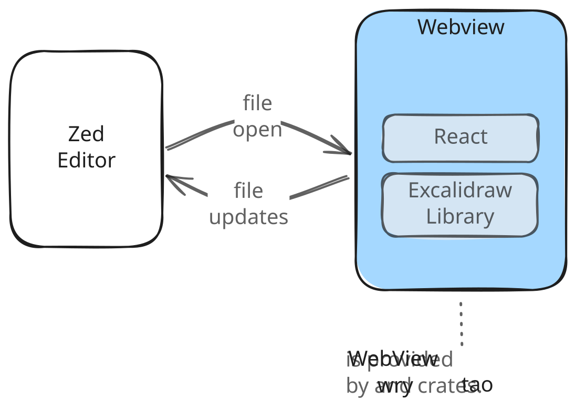

# Excalidraw Preview for Zed

> Source Repository: <https://github.com/yankeeinlondon/excalidraw-zed-extension>




A Zed editor extension that previews [Excalidraw]() files in a native WebView window:

- Live reloads on file save
- No browser tabs
- Pure offline
- Near zero latency diagram preview
- Supports `.excalidraw` (JSON), `.excalidraw.svg`, and `.excalidraw.png` file formats


> `Extension Status`: **submitted to the official registry** 
>
> This extension has been submitted to the [Zed extension registry](https://github.com/zed-industries/extensions/pull/6468). Once that PR is merged, you'll be able to install it directly from Zed's **Extensions** panel (search for *Excalidraw Preview*). Until then, install it locally from source using the steps below.


## Installation

### Install from Zed (once published)

> ⏳ available after [registry PR #6468](https://github.com/zed-industries/extensions/pull/6468) is merged.

Open the command palette → **`zed: extensions`** → search for **Excalidraw Preview** → **Install**.

That's the whole install once it's in the registry — no Rust, Node, or build step required; the companion binary is downloaded automatically on first use. Until the PR lands, use the local install below.

### Install Locally

```bash
# clone repo
git clone https://github.com/yankeeinlondon/excalidraw-zed-extension.git
# move into repo
cd excalidraw-zed-extension
# use the `just` install recipe 
just install-locally
```

You do need to have `just` installed (available through most OS level package managers) but once `just` installed just run `just install-locally` and the recipe will:

- check all prerequisities
- adds a WASM target for Rust
- builds the UI and release binary
- symlinks the binary onto your PATH

Once this recipe has complete the only thing left to do is open the _command palette_ in Zed and search for "zed: install dev extension". You'll then navigate and select the `./extension` directory of the locally cloned repo.

### Prerequisites

- **Rust** (via `rustup`) + **Cargo**
- **Node.js** (for building the webview)
- **[`just`](https://github.com/casey/just)** — the command runner that drives the build (`cargo install just`, `brew install just`, or see its README)
- **macOS**: WebKit (built-in)
- **Linux**: `sudo apt install libwebkit2gtk-4.1-dev`
- **Windows**: WebView2 (built-in on Win11)

### Build from source (manual steps)

`just install-locally` (above) runs all of these for you. Use the granular recipes if you
want to run a single step:

```bash
# clone the repository
git clone https://github.com/yankeeinlondon/excalidraw-zed-extension.git
cd excalidraw-zed-extension

rustup target add wasm32-wasip1   # one-time: install WASM target
just ui build                     # build UI + release binary
just symlink                      # one-time: symlink binary onto PATH
```

Run `just` on its own to list every available recipe.

### Install the extension locally

In Zed: command palette → **"zed: install dev extension"** → select the `./extension`
directory (inside the cloned repo).

This installs the extension straight from your local clone — no registry needed. To pick
up new changes later, `git pull`, re-run `just install-locally`, then re-run
**"zed: install dev extension"**.

## Usage


https://github.com/user-attachments/assets/af3cd686-56b8-413c-9012-0f1c75e5f6c9


1. Open any `.excalidraw`, `.excalidraw.svg`, or `.excalidraw.png` file in Zed.
2. Run `/preview-excalidraw` from the command palette.
3. A native window opens with the rendered diagram.
4. Save the file in Zed — preview updates automatically.

Re-running the command focuses the existing window instead of opening a new one.

### Auto-save

Pass `--auto-save` to enable debounced auto-save (600 ms after every change):

```
/preview-excalidraw --auto-save
```

### Run Without Zed

```bash
./target/release/excalidraw-preview ./path/to/diagram.excalidraw --debug
./target/release/excalidraw-preview ./path/to/diagram.excalidraw.svg
```

## Creating a new drawing

Three ways, pick your favorite:

1. **Project panel (recommended):** right-click → *New File* → name it `whiteboard.excalidraw`.
   The extension detects the empty file, writes a valid blank scene into it, and opens
   the preview on an empty canvas.
2. **Assistant panel:** `/new-excalidraw [name]` creates `name.excalidraw` (or
   `untitled-N.excalidraw`) in the workspace root and opens the preview.
3. **Terminal:** `excalidraw-preview --new path/to/drawing.excalidraw`

Want a command-palette entry? Zed extensions can't register palette actions yet
(zed-industries/zed#8441), but you can wire a Zed task to the CLI. Add to your `tasks.json`:

```json
{
  "label": "new excalidraw drawing",
  "command": "excalidraw-preview",
  "args": ["--new", "$ZED_WORKTREE_ROOT/untitled.excalidraw"]
}
```

then run it via `task: spawn` in the command palette.

## Known limitations

- **No command-palette / context-menu entries.** Zed's extension API has no UI
  contribution points (tracked upstream: zed-industries/zed#8441, #18043). If Zed ships
  extension-registered actions, a *New Excalidraw Drawing* palette action will become the
  primary creation flow (it's a thin wrapper over `--new`).
- **"Browse libraries" doesn't work** inside the preview window — the excalidraw.com
  round-trip needs a browser. Library items you add locally persist in
  `<config-dir>/excalidraw-zed/library.excalidrawlib` and are shared across all diagrams.
- **`.excalidraw.png` click-to-open:** _record Task 13 outcome here — auto-opens, or use
  `/preview-excalidraw` as the entry point._
